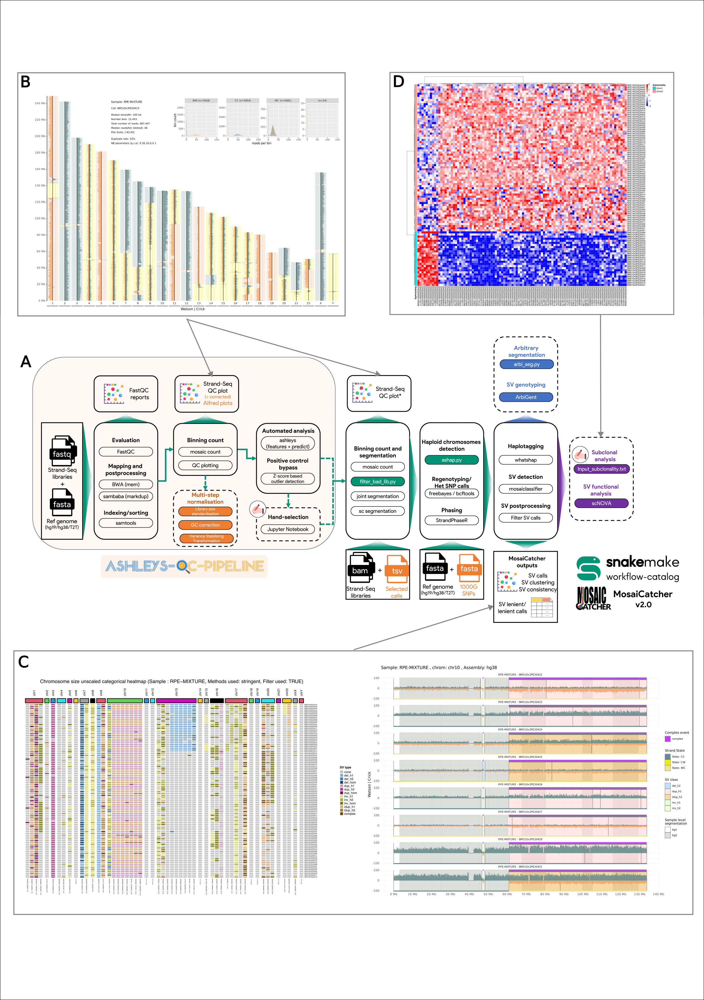

Structural variant calling from single-cell Strand-seq data [Snakemake](https://github.com/snakemake/snakemake) pipeline.

# Overview of this workflow

This workflow uses [Snakemake](https://github.com/snakemake/snakemake) to
execute all steps of MosaiCatcher in order. The starting point are single-cell
BAM files from Strand-seq experiments and the final output are SV predictions in
a tabular format as well as in a graphical representation. To get to this point,
the workflow goes through the following steps:

1. Binning of sequencing reads in genomic windows of 100kb via [mosaic](https://github.com/friendsofstrandseq/mosaicatcher)
2. Strand state detection
3. [Optional]Normalization of coverage with respect to a reference sample
4. Multi-variate segmentation of cells ([mosaic](https://github.com/friendsofstrandseq/mosaicatcher))
5. Haplotype resolution via [StrandPhaseR](https://github.com/daewoooo/StrandPhaseR)
6. Bayesian classification of segmentation to find SVs using MosaiClassifier
7. Visualization of results using custom R plots

|                                         |
| :--------------------------------------------------------------------------------: |
|                         _MosaiCatcher snakemake pipeline_                          |
| _[ashleys-qc-pipeline](https://github.com/friendsofstrandseq/ashleys-qc-pipeline)_ |

# 📘 Documentation

- [Quick Start](docs/usage.md#quick-start)
- [Usage](docs/usage.md)
- [Parameters & input](docs/parameters.md)
- [Output](docs/output.md)
- [Configuration file](config/README.md)
- [Update the pipeline](docs/usage.md#update-procedure)

# 📆 Roadmap

## Technical-related features

- [x] Zenodo automatic download of external files + indexes ([1.2.1](https://github.com/friendsofstrandseq/mosaicatcher-pipeline/releases/tag/1.2.1))
- [x] Multiple samples in the parent folder ([1.2.2](https://github.com/friendsofstrandseq/mosaicatcher-pipeline/releases/tag/1.2.2))
- [x] Automatic testing of BAM SM tag compared to sample folder name ([1.2.3](https://github.com/friendsofstrandseq/mosaicatcher-pipeline/releases/tag/1.2.3))
- [x] On-error/success e-mail ([1.3](https://github.com/friendsofstrandseq/mosaicatcher-pipeline/releases/tag/1.3))
- [x] HPC execution (slurm profile for the moment) ([1.3](https://github.com/friendsofstrandseq/mosaicatcher-pipeline/releases/tag/1.3))
- [x] Full singularity image with preinstalled conda envs ([1.5.1](https://github.com/friendsofstrandseq/mosaicatcher-pipeline/releases/tag/1.5.1))
- [x] Single BAM folder with side config file ([1.6.1](https://github.com/friendsofstrandseq/mosaicatcher-pipeline/releases/tag/1.6.1))
- [x] (EMBL) GeneCore mode of execution: allow selection and execution directly by specifying genecore run folder (2022-11-02-H372MAFX5 for instance) ([1.8.2](https://github.com/friendsofstrandseq/mosaicatcher-pipeline/releases/tag/1.8.2))
- [x] Version synchronisation between ashleys-qc-pipeline and mosaicatcher-pipeline ([1.8.3](https://github.com/friendsofstrandseq/mosaicatcher-pipeline/releases/tag/1.8.3))
- [x] Report captions update ([1.8.5](https://github.com/friendsofstrandseq/mosaicatcher-pipeline/releases/tag/1.8.5))
- [x] Clustering plot (heatmap) & SV calls plot update ([1.8.6](https://github.com/friendsofstrandseq/mosaicatcher-pipeline/releases/tag/1.8.6))
- [ ] Plotting options (enable/disable segmentation back colors)

## Bioinformatic-related features

- [x] Self-handling of low-coverage cells ([1.6.1](https://github.com/friendsofstrandseq/mosaicatcher-pipeline/releases/tag/1.6.1))
- [x] Upstream [ashleys-qc-pipeline](https://github.com/friendsofstrandseq/ashleys-qc-pipeline.git) and FASTQ handle ([1.6.1](https://github.com/friendsofstrandseq/mosaicatcher-pipeline/releases/tag/1.6.1))
- [x] Change of reference genome (currently only GRCh38) ([1.7.0](https://github.com/friendsofstrandseq/mosaicatcher-pipeline/releases/tag/1.7.0))
- [x] Ploidy detection at the segment and the chromosome level: used to bypass StrandPhaseR if more than half of a chromosome is haploid ([1.7.0](https://github.com/friendsofstrandseq/mosaicatcher-pipeline/releases/tag/1.7.0))
- [x] inpub_bam_legacy mode (bam/selected folders) ([1.8.4](https://github.com/friendsofstrandseq/mosaicatcher-pipeline/releases/tag/1.8.4))
- [x] Blacklist regions files for T2T & hg19 ([1.8.5](https://github.com/friendsofstrandseq/mosaicatcher-pipeline/releases/tag/1.8.5))
- [ ] Pooled samples

## Small issues to fix

- [ ] Move pysam / SM tag comparison script to snakemake rule
- [x] replace `input_bam_location` by `data_location` (harmonization with [ashleys-qc-pipeline](https://github.com/friendsofstrandseq/ashleys-qc-pipeline.git))
- [x] List of commands available through list_commands parameter ([1.8.6](https://github.com/friendsofstrandseq/mosaicatcher-pipeline/releases/tag/1.8.6)

# 🛑 Troubleshooting & Current limitations

- Do not change the structure of your input folder after running the pipeline, first execution will build a config dataframe file (`OUTPUT_DIRECTORY/config/config.tsv`) that contains the list of cells and the associated paths
- Do not change the list of chromosomes after a first execution (i.e: first execution on `chr17`, second execution on all chromosomes)

# 💂‍♂️ Authors (alphabetical order)

- Ashraf Hufash
- Cosenza Marco
- Ebert Peter
- Ghareghani Maryam
- Grimes Karen
- Gros Christina
- Höps Wolfram
- Jeong Hyobin
- Kinanen Venla
- Korbel Jan
- Marschall Tobias
- Meiers Sasha
- Porubsky David
- Rausch Tobias
- Sanders Ashley
- Van Vliet Alex
- Weber Thomas (maintainer and current developer)

# 📕 References

> Strand-seq publication: Falconer, E., Hills, M., Naumann, U. et al. DNA template strand sequencing of single-cells maps genomic rearrangements at high resolution. Nat Methods 9, 1107–1112 (2012). https://doi.org/10.1038/nmeth.2206

> scTRIP/MosaiCatcher original publication: Sanders, A.D., Meiers, S., Ghareghani, M. et al. Single-cell analysis of structural variations and complex rearrangements with tri-channel processing. Nat Biotechnol 38, 343–354 (2020). https://doi.org/10.1038/s41587-019-0366-x
