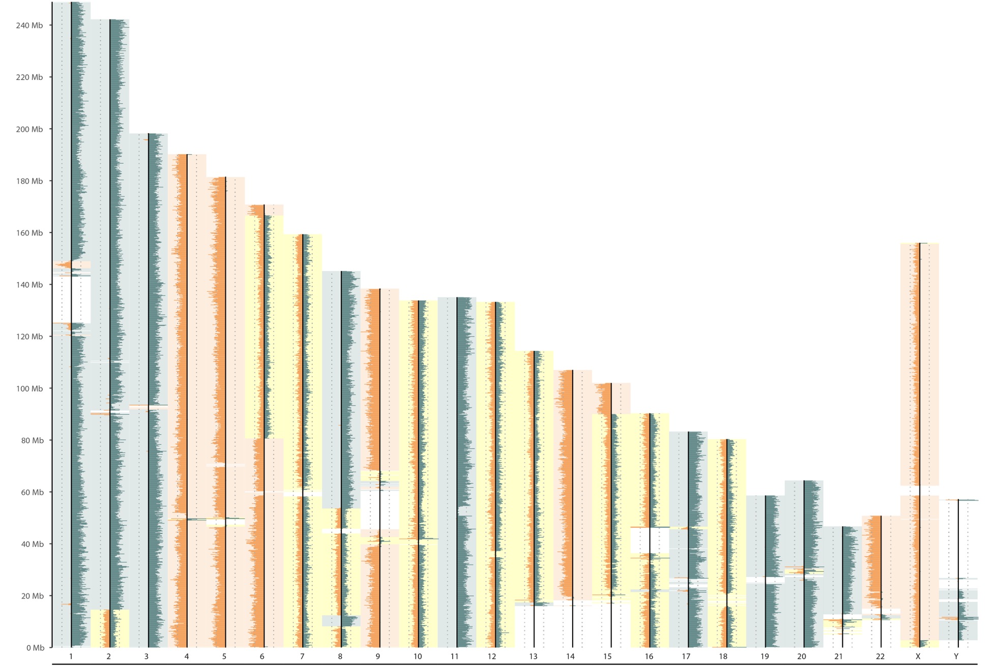
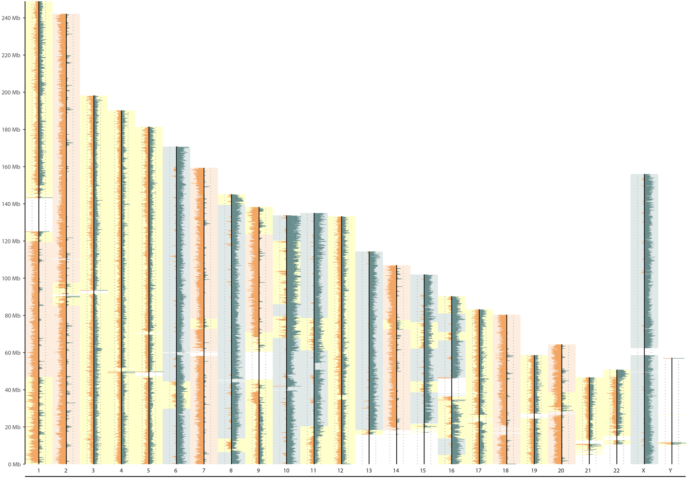
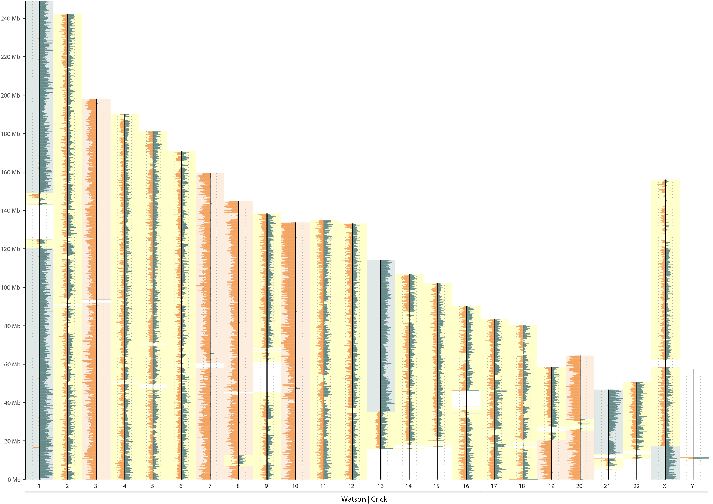
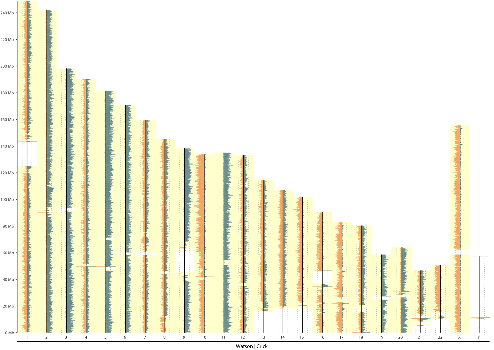
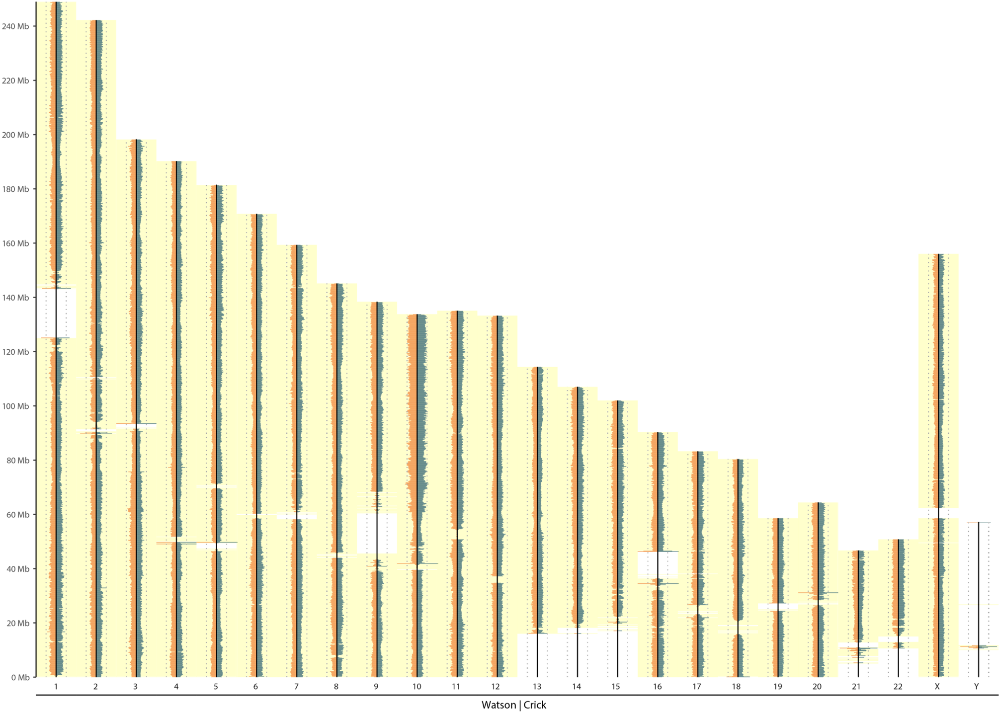
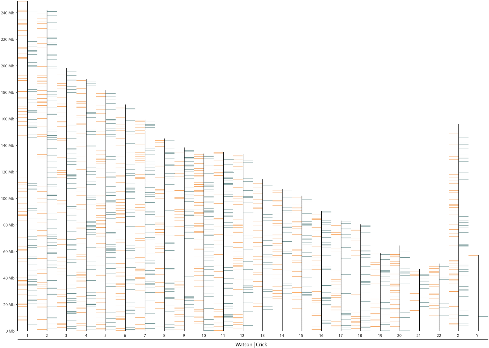

# Mosaic count plots examples

## High-quality example

|  |
| :----------------------------------: |
|        *High-quality example*        |

## Low-quality examples

### Under-BrdU incorporation

|                              |
| :-----------------------------------------------------------------: |
|                     *Under-BrdU incorporation*                      |
| *little spikes = nascent DNA strand that were not degrade properly* |

### Over-BrdU incorporation

|             |
| :-----------------------------------------------: |
|             *Over-BrdU incorporation*             |
| *BrdU degraded both nascent and template strands* |

### Background contamination

|        |
| :---------------------------------------------------: |
|              *Background contamination*               |
| *Noisy background reads make all chromosomes look WC* |

### Multiple cell sequenced instead of single

|  |
| :-------------------------------------: |
|     *Multi cell (Positive control)*     |

### No cell sequenced

|  |
| :------------------------------------: |
|     *Zero cell (Negative control)*     |