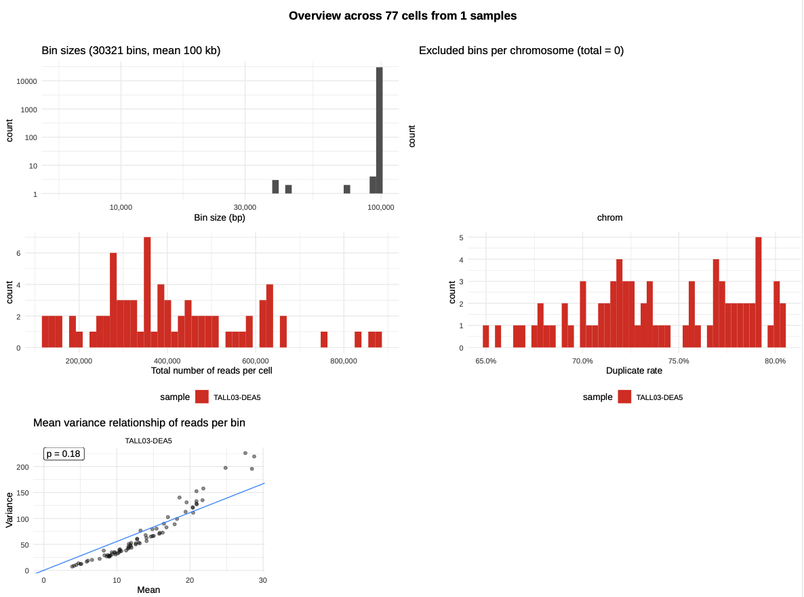
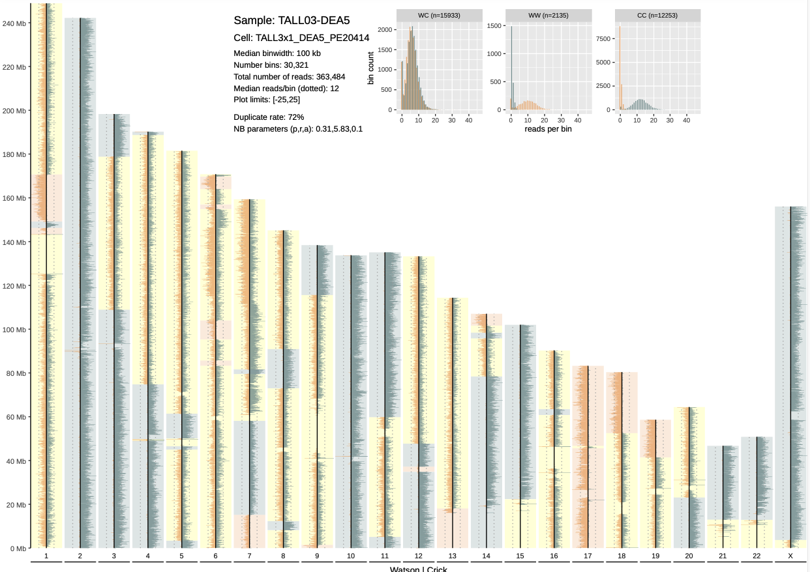
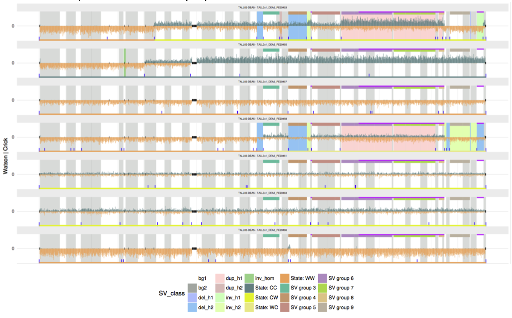
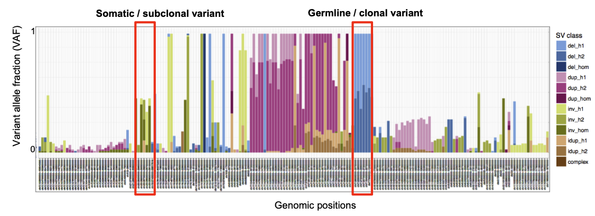
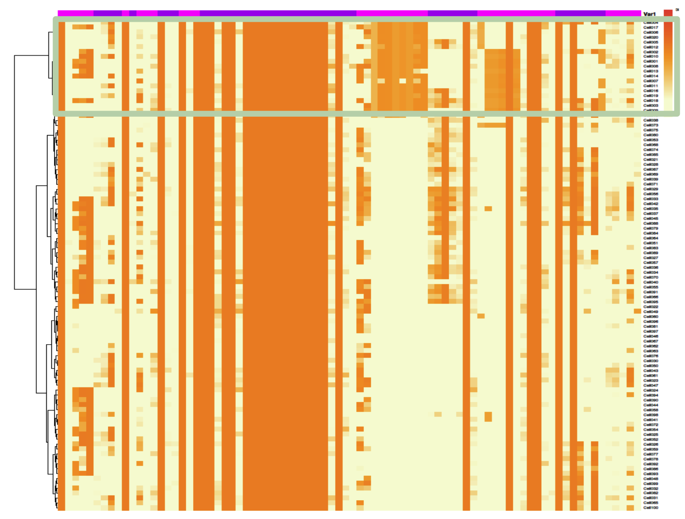
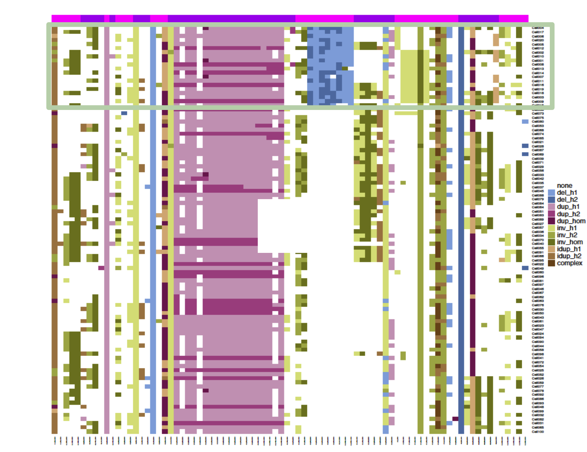

# Outputs (ongoing)

This document describes the final outputs produced by the pipeline. Most of the plots are taken from report generated from the [full-sized test dataset](https://sandbox.zenodo.org/record/1074721) for the pipeline.

The files listed below will be created in the selected results directory (`output_location` parameter). All paths are relative to the top-level results directory.

## Directory structure (example for `<SAMPLE>`=*RPE-BM510*)

```bash
<OUTPUT>
|-- config
|   |-- ref_genomes
|   `-- RPE-BM510
|-- counts
|   `-- RPE-BM510
|       `-- counts-per-cell
|-- haplotag
|   |-- bam
|   |   `-- RPE-BM510
|   |-- bed
|   `-- table
|       `-- RPE-BM510
|           `-- by-cell
|-- log 
|   |-- ...
|   `-- ...
|-- merged_bam
|   `-- RPE-BM510
|-- mosaiclassifier
|   |-- haplotag_likelihoods
|   |-- postprocessing
|   |   |-- filter
|   |   |   `-- RPE-BM510
|   |   |-- group-table
|   |   |   `-- RPE-BM510
|   |   `-- merge
|   |       `-- RPE-BM510
|   |-- sv_calls
|   |   `-- RPE-BM510
|   `-- sv_probabilities
|       `-- RPE-BM510
|-- plots
|   `-- RPE-BM510
|       |-- counts
|       |-- final_results
|       |-- sv_calls
|       |-- sv_clustering
|       `-- sv_consistency
|-- segmentation
|   `-- RPE-BM510
|       `-- segmentation-per-cell
|-- snv_genotyping
|   `-- RPE-BM510
|-- stats
|   `-- RPE-BM510
`-- strandphaser
    |-- phased-snvs
    |-- RPE-BM510
    |   `-- StrandPhaseR_analysis.chr21
    |       |-- browserFiles
    |       |-- data
    |       |-- Phased
    |       |-- SingleCellHaps
    |       `-- VCFfiles
    `-- R_setup
```


## Plots folder

### Mosaic count - reads density across bins

---
File path: `<OUTPUT_FOLDER>/plots/<SAMPLE>/counts/CountComplete.pdf`

Report category: `Mosaic counts`

---


The plots present in this file will allow you to visualize both global statistics at the sample level 
but also individual Strand-Seq karyotypes at the cell level.

The first page of the pdf file shows the statistics of the analysis result, such
as the distribution of total number of reads per cell, duplication rate, or excluded bins per chromosomes. 


|  |
| :--------------------------------: |
| *Global statistics - Sample level* |

Afterwards, every pages show the overview of binning count result of each of the single-cells as presented below. The depth of Crick reads are depicted in the green color in the right side, and the depth of Watson reads are depicted in the orange color in the left side of each chromosome lines. HMM automatically defines the WW/WC/CC status according the reads distribution (yellow background: WC, green background: CC, orange background: WW).


|      |
| :----------------------------------: |
| *Strand-seq karyotype visualisation* |

*Strand-seq karyotype visualisation based on reads counting according defined window (here 100kb). Additionnal statistics are also presented in the upper part of the figure.* 


Examples of good-quality and low-quality cells are presented [here](./mosaic_count.md)

### SV calls
---
File path: `<OUTPUT_FOLDER>/plots/<SAMPLE>/sv_calls/<METHOD>.<CHR>.pdf`

Report category: `SV Calls`


---
The SV calls plots allow to identify and analyse at the single-cell level, the SV detected in the pipeline. 


SV calls plot correspond to chromosome-wise plots summarizing all informations computed during the pipeline (count binning = orange/green core signal, grey/white background: mosaic segments, bottom green/yellow/orange line: W/C state, additional colors: SV groups). 

Each different file corresponds to a different chromosome and each file presents a different track for each library processed successfully during the pipeline. 

As two different filtering methods are currently set (stringent/lenient filtering, stringent: a SV must be present in more than 5% of the cells), two groups of files can be found:
- simpleCalls_llr4_poppriorsTRUE_haplotagsFALSE_gtcutoff0.05_regfactor6_filterTRUE.chr<N>.pdf
- simpleCalls_llr4_poppriorsTRUE_haplotagsTRUE_gtcutoff0_regfactor6_filterFALSE.chr<N>.pdf

Description of the parameters used can be found in th[parameters section here](./parameters.md).


|                                                                                          |
| :---------------------------------------------------------------------------------------------------------------------------: |
|                                                          *SV calls*                                                           |
| *Here we can identify heterozygous deletions (blue) as well as heterozygous duplication (pink) on cells PE20453 and PE20458.* |


### SV consistency
---
File path: `<OUTPUT_FOLDER>/plots/<SAMPLE>/sv_consistency/<METHOD>.consistency-barplot-<byaf|bypos>.pdf`

Report category: `SV Consistency`


---


SV consistency plots correspond to barplots representing SV events (rows) according their frequency across cells and their class (del, dup, inv, ...).

These plots are complentary to the other outputs available and are presented either sorted by Variant Allele Fraction (VAF) or by position. 

Like SV calls and SV clustering plots, SV consistency are also presented regarding the two filtering methods (stringent/lenient filtering), two groups of files can be found:
- simpleCalls_llr4_poppriorsTRUE_haplotagsFALSE_gtcutoff0.05_regfactor6_filterTRUE.<byaf|bypos>.pdf
- simpleCalls_llr4_poppriorsTRUE_haplotagsTRUE_gtcutoff0_regfactor6_filterFALSE.<byaf|bypos>.pdf

Here are some important points to better analyse these plots:

- If the VAF is close to 1, the SVs are expected to be germline variant
- If the VAF is below 1, the SVs are expected to be somatic variant
- If the SVs only detected by one cell, it can be rare SV event, or an SCE (sister chromatid exchange) event
- SCEs happen independently in each single cell, and unlike SVs, SCEs are not transmitted clonally to
daughter cells. Hence, changepoints resulting from SCEs are very unlikely to recur at the same position in >1 cell of a sample


|  |
| :--------------------------------------------: |
|       *SV consistency (position sorted)*       |


### SV clustering
---
File path: `<OUTPUT_FOLDER>/plots/<SAMPLE>/sv_clustering/<CELL>.pdf`

Report category: `SV Clustering`

---

SV clustering are complementary to previously presented plots, as the heatmap representation allow user to have a complete and global representation of the SVs at the sample level.

Each file is composed of two plots: 
- a clustering heatmap where cells (rows) were ordered automatically using [Ward Hierarchical Agglomerative clustering](http://adn.biol.umontreal.ca/~numericalecology/Reprints/Murtagh_Legendre_J_Class_2014.pdf) based on the number of cells presenting each SV (columns). SV are horizontally sorted by genomic position (chr1..22, X, Y)
- a similar heatmap (same horizontal and vertical sorting) but highlighting both SV type (dup, del, inv, ...) and SV haplotype phasing (H1/H2/Hom)

Two types of files are accesible from the user:
- simpleCalls_llr4_poppriorsTRUE_haplotagsFALSE_gtcutoff0.05_regfactor6_filterTRUE-<chromosome|position>.pdf
  - position: no scaling
  - chromosome: chromosome-size scaled

By using these heatmaps, the user can easily identify subclones based on the SV position and enrichment across cells, as presented below.


|  |
| :-------------------------------------: |
|     *1. SV clustering (SV density)*     |

|  |
| :----------------------------------------: |
|        *2. SV clustering (SV type)*        |


## Statistics
---
File path: `<OUTPUT_FOLDER>/stats/<SAMPLE>/stats-merged.tsv`

Report category: `Stats`

---


| Col nb | Col title                       | Comment                                                                                  |
| ------ | ------------------------------- | ---------------------------------------------------------------------------------------- |
| 1      | callset                         | mosaiclassifier SV callset filename                                                      |
| 2      | cell_count                      | number of librairies processed                                                           |
| 3      | segments                        | number of segments identified                                                            |
| 4      | total_sce                       | total nb of sister-chromatid-exchange identified                                         |
| 5      | avg_sce_per_cell                | average nb of sister-chromatid-exchange per cell identified                              |
| 6      | total_calls                     | total nb of SV detected                                                                  |
| 7      | unique_calls                    | nb of unique SV detected                                                                 |
| 8      | unique_calls_merged             |                                                                                          |
| 9      | complex_lengths_mb              | cumulative size of complex SV (Mb) detected                                              |
| 10     | total_calls_complex             | total nb of complex SV detected                                                          |
| 11     | unique_calls_complex            | nb of unique complex SV detected                                                         |
| 12     | avg_sv_load_per_cell_mb         | average size of SV (Mb) detected per cell                                                |
| 13     | avg_sv_load_per_cell_complex_mb | average size of complex SV (Mb) detected per cell                                        |
| 14     | calls_af0to10                   | nb of SV calls where SV sample allelic frequency is 0 < x < 10%                          |
| 15     | calls_af10to80                  | nb of SV calls where SV sample allelic frequency is 10 < x < 80%                         |
| 16     | calls_af80to100                 | nb of SV calls where SV sample allelic frequency is 80 < x < 100%                        |
| 17     | length_sum_af0to10_mb           | cumulative length of SV calls where SV sample allelic frequency is 0 < x < 10%           |
| 18     | length_sum_af10to80_mb          | cumulative length of SV calls where SV sample allelic frequency is 10 < x < 80%          |
| 19     | length_sum_af80to100_mb         | cumulative length of SV calls where SV sample allelic frequency is 80 < x < 100%         |
| 20     | calls_af0to10_complex           | nb of complex SV calls where SV sample allelic frequency is 0 < x < 10%                  |
| 21     | calls_af10to80_complex          | nb of complex SV calls where SV sample allelic frequency is 10 < x < 80%                 |
| 22     | calls_af80to100_complex         | nb of complex SV calls where SV sample allelic frequency is 80 < x < 100%                |
| 23     | length_sum_af0to10_complex_mb   | cumulative length of complex SV calls where SV sample allelic frequency is 0 < x < 10%   |
| 24     | length_sum_af10to80_complex_mb  | cumulative length of complex SV calls where SV sample allelic frequency is 10 < x < 80%  |
| 25     | length_sum_af80to100_complex_mb | cumulative length of complex SV calls where SV sample allelic frequency is 80 < x < 100% |


## Raw SV calls (tab-seperated file)
---
File path: `<OUTPUT_FOLDER>/mosaiclassifier/sv_calls/<SAMPLE>/<method>.pdf`

---

Columns:
| Col nb | Col title             | Comment                       |
| ------ | --------------------- | ----------------------------- |
| 1      | chrom                 | chromosome                    |
| 2      | start                 | chromosome start              |
| 3      | end                   | chromosome end                |
| 4      | sample                | sample name                   |
| 5      | cell                  | cell name                     |
| 6      | class                 | WC/WW/CC/CW                   |
| 7      | scalar                |                               |
| 8      | num_bins              | number of bins overlapping SV |
| 9      | sv_call_name          | SV type                       |
| 10     | sv_call_haplotype     |                               |
| 11     | sv_call_name_2nd      |                               |
| 12     | sv_call_haplotype_2nd |                               |
| 13     | llr_to_ref            |                               |
| 14     | llr_to_2nd            |                               |
| 15     | af                    | SV allelic frequency          |